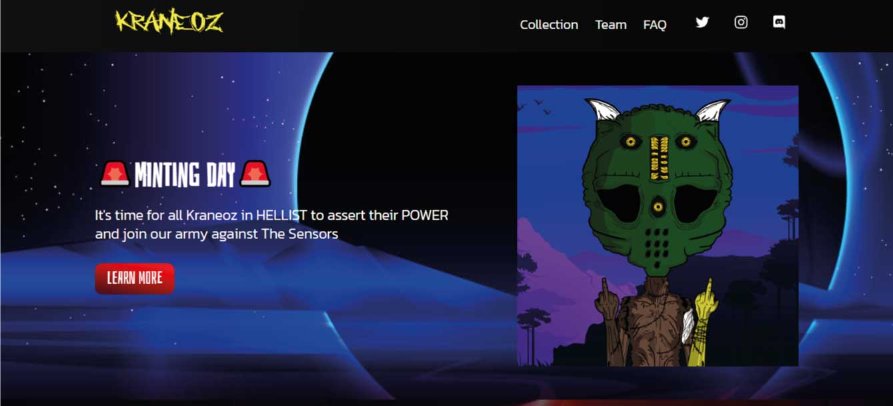

# KRANEOZ App

Welcome to KRANEOZ, an application built with React and Next.js.

## Description

KRANEOZ is a dynamic React Single Page App featuring a sleek UI, responsive design, and smooth navigation. Enhance user experience with this versatile and modern web application.

You can view the deployed demo [here](https://kraneoz.vercel.app/)


## Key Features

- [List of key features]

## Technologies Used

- React
- Next.js

## Prerequisites

Make sure to have the following tools installed before running the application:

- [Node.js](https://nodejs.org/)
- [npm](https://www.npmjs.com/) (or [Yarn](https://yarnpkg.com/) if you prefer)

## Installation

1. Clone this repository:

   ```bash
   git clone https://github.com/ericsandev/kraneoz.git
   ```

2. Navigate to the project directory:

```bash
cd kraneoz
```

3. Install dependencies:
```bash
npm install
or
yarn install
```
## Usage
Start the application with the following command:
```bash
npm run dev
```
or with Yarn:
```bash
yarn dev
```
Open your browser and visit http://localhost:3000 to view the landing page.

## Contribution
If you want to contribute to this project, follow these steps:

- Fork the repository.
- Create a new branch for your feature or bug fix: `git checkout -b branch-name`
- Make your changes and commit: `git commit -m "Description of changes"`
- Push your changes to the remote repository: `git push origin branch-name`
- Open a pull request on GitHub.


## License
This project is licensed under the [License Name]. See the LICENSE file for more details.

## Contact
For any questions or comments, contact us at [ericsandev0@gmail.com].